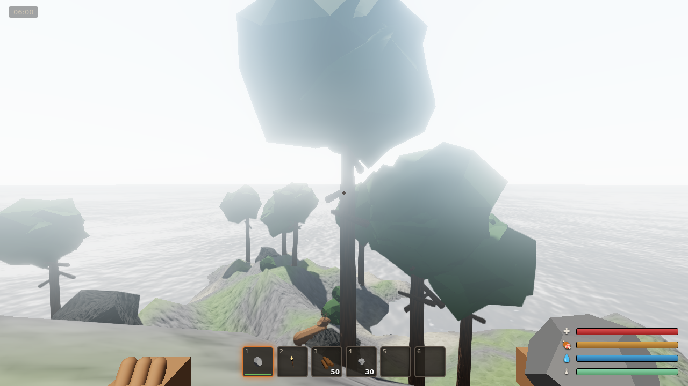
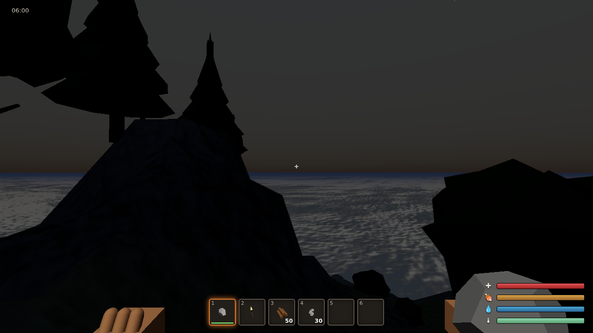

# Rustlike — Design & Code Walkthrough

*A from-scratch browser survival game built with Three.js. This document explains
what was built, the intuition behind the hard parts, and how it was verified.*

---

## Background

### For the newcomer (skip if you know WebGL/Three.js)

A modern browser can draw hardware-accelerated 3D through **WebGL**. Writing raw
WebGL is tedious, so almost everyone uses a library; **Three.js** is the most
popular. It gives you a `Scene` (a tree of objects), `Mesh`es (geometry +
material), `Light`s, and a `Camera`, and a `WebGLRenderer` that turns all of that
into pixels every frame.

Two ideas recur throughout this project:

> **Callout — Procedural generation.** Instead of loading art files (`.png`,
> `.glb`), we *compute* everything at run time: terrain height, tree shapes,
> textures, even the player's hands. The core primitive is **noise** — a smooth,
> pseudo-random function of position. Summing several octaves of noise at
> different frequencies (*fractal Brownian motion*, "fbm") produces natural-looking
> hills, bark, and rock.

> **Callout — PBR (physically-based rendering).** Materials are described by
> physical-ish parameters — base colour, *roughness*, *metalness* — and lit by
> lights with real falloff. Combined with **tonemapping** (mapping high-dynamic-range
> light into displayable colour) this is what makes surfaces read as "realistic"
> rather than flat.

### The constraints that shaped the design

Three requirements drove most of the architecture:

1. **No build step.** The game must run behind a plain static file server. So
   there is no bundler, no transpiler — just ES modules loaded by the browser via
   an [import map](../index.html). Three.js and the handful of addons we use are
   *vendored* under `vendor/three/` so the game also runs completely offline.
2. **Everything from scratch, procedurally.** No external assets, and explicitly
   nothing from Rust or any other commercial game. Every mesh and texture in the
   repo is authored in code.
3. **Keep and improve the survival mechanics** — first-person movement, gathering,
   inventory/hotbar, crafting, building with collision, survival stats, melee +
   ranged combat, animal AI, deployables, day/night, and death/respawn.

---

## Intuition

The game is a loop over a handful of independent systems that share a little
state. The mental model is:

```
input ─▶ player (physics) ─▶ camera
                   │
world (terrain+sky+water) ─┼─▶ renderer + post-processing ─▶ screen
                   │
resources / animals / drops / deployables / building
                   │
inventory ─ crafting ─ survival ─ combat ─▶ HUD
```

A few pieces are worth building intuition for before reading code.

### The world is one height field, sampled two ways

The island is a single function `h = height(x, z)`. We evaluate it on a grid to
build the terrain **mesh** you see, and we *also* keep the raw numbers so physics
can ask "how high is the ground here?" cheaply and get **exactly** the value the
mesh was built from.

Concretely, with a toy 3×3 grid of heights and a player standing at a
non-grid point, we bilinearly interpolate the four surrounding samples:

```
heights          player at (0.5, 0.5) between four cells
 2 ── 4          top = lerp(2,4,0.5)=3
 │    │          bot = lerp(6,8,0.5)=7
 6 ── 8          h   = lerp(3,7,0.5)=5   ← ground height under the player
```

Because the mesh uses the same samples, the player's feet never sink into or
float above the visible ground.

### Two scenes so the hands never clip

First-person games have a classic problem: the gun/hands are *right against the
camera*, so they poke through walls. The trick used here is to render the world,
then **clear only the depth buffer**, then render the hands with a *second*
camera. The hands live in their own tiny scene with their own lighting and can
never intersect world geometry. (See `Engine.render()`.)

### Day/night is one angle

A single value, `timeOfDay ∈ [0,24)`, drives a sun direction on a circle. Its
*elevation* (how far above the horizon) becomes a `dayFactor ∈ [0,1]` via a
smoothstep, and nearly everything visual — sun colour/intensity, ambient fill,
fog colour, star opacity, camera exposure, bloom strength, even air temperature —
is just an interpolation on that one number.

|  Day (`?time=11.5`) | Night (`?time=22`) |
| --- | --- |
|  |  |

---

## Code

A high-level tour, grouped by subsystem. Paths are under `src/`.

### 1. Engine & the two-pass render (`core/engine.js`)

The renderer is configured for a realistic look, and a post-processing
`EffectComposer` adds bloom + FXAA. The viewmodel is drawn *after* the composer
on a cleared depth buffer:

```js
render() {
  this.renderer.clear();
  this.composer.render();          // world, with bloom + FXAA
  this.renderer.clearDepth();       // fresh depth range
  this.renderer.render(this.vmScene, this.vmCamera); // hands on top
}
```

`renderer.autoClear = false` is essential — otherwise the second render would
wipe the world.

### 2. Noise & the world (`core/noise.js`, `world/world.js`)

A seeded `mulberry32` PRNG feeds a `SimplexNoise` wrapper with `fbm()` and
`ridged()` helpers. Terrain height combines a continent shape, hills, and ridged
mountains, then applies a **radial island mask** so land sinks into ocean at the
edges:

```js
let h = continent * 15 + hills * 5 + ridge * mountainMask * 42;
h = (h + 7) * mask - 7;   // mask ≈ 1 at centre, 0 at the rim
```

The mesh is a hand-built `BufferGeometry` with per-vertex biome **colours** (sand,
grass, rock, snow), and a procedural detail `map` / `normalMap` / `roughnessMap`
generated on a `<canvas>` (`world/textures.js`). Physics reads height via bilinear
`heightAt(x,z)`.

### 3. Sky, sun & water (`world/sky.js`, `world/water.js`)

`SkySystem` owns the atmospheric `Sky` shader, a shadow-casting sun
`DirectionalLight`, a cool moon light, a hemisphere fill, `FogExp2`, visible
sun/moon discs, and a `Points` star field. Everything is interpolated on the
day factor; at night the atmospheric scattering is damped so the sky reads dark:

```js
u['rayleigh'].value = lerp(0.35, 2.4, day);   // less scattering → darker night
this.stars.material.opacity = clamp(1 - day * 1.6, 0, 1);
this.ambientTemp = lerp(4, 26, day) - 2 * Math.max(0, -elev);
```

The ocean is Three's reflective `Water` object fed a **procedural** normal map and
the live sun direction, so it mirrors the sky and produces a bloom-friendly glint.

### 4. Physics & the player (`entities/physics.js`, `entities/player.js`)

The world stores three kinds of colliders: **cylinders** (tree trunks, boulders),
**AABBs** (walls, deployables), and **platforms** (foundations, floors, stairs).
Horizontal movement pushes the player circle out of cylinders/boxes;
`supportHeight()` finds the highest standable surface under the player that isn't
more than a *step height* above their feet — which is what lets you walk **up
stairs** but not teleport onto a rooftop.

```js
supportHeight(x, z, feetY) {
  let g = this.terrain.heightAt(x, z);
  const tol = feetY + this.stepHeight + 0.05;
  for (const p of this.platforms)
    if (insideRect(p, x, z) && p.top <= tol && p.top > g) g = p.top;
  return g;
}
```

The `Player` integrates gravity, resolves collisions, follows the ground,
implements buoyant **swimming** below sea level, and drives the main camera.

### 5. Procedural models (`models/*`)

Every mesh is code. `nature.js` deforms icosahedra into boulders and stacks cones
for pines; `animals_models.js` builds rigged quadrupeds whose legs are child
groups that pivot for a walk cycle; `items.js` is a registry of tool/weapon/food
models reused for the **held viewmodel**, the **world drop**, and the **inventory
icon**; `buildings.js` and `deployables.js` emit both geometry *and* collider
metadata (`aabbs`, `platforms`).

The **viewmodel** (`models/viewmodel.js`) attaches the current tool to a hand and
animates idle bob, mouse sway, and a swing arc:

```js
const p = Math.sin(t * Math.PI);   // 0→1→0 over the swing
armRotX  = -p * 1.5;               // overhead chop arc
```

### 6. Gameplay systems (`systems/*`)

- **inventory.js** — hotbar + backpack + wear, with stack-aware add/remove.
- **crafting.js** — affordability + station-proximity checks, then the transaction.
- **building.js** — snaps a translucent **ghost** to the grid (foundations) or a
  foundation **edge** (walls), validates the spot, then spawns the real piece and
  registers its colliders (rotating the AABBs for 90° placements).
- **combat.js** — raycasts from the crosshair on a swing to gather resources or
  damage animals; wears down tool durability; fires **arrow projectiles** with
  gravity for the bow.
- **survival.js** — drains hunger/thirst, tends body temperature toward an
  environment-driven target (fire, clothing, sun, water), and applies
  starvation/dehydration/hypothermia or regeneration.
- **deployables.js** — placement, fire flicker, warmth queries, and the
  cooking/smelting that turns raw meat → cooked and ore → fragments over time.

### 7. UI (`ui/*`)

`icons.js` renders each item's 3D model once with a small dedicated renderer and
caches the image, so hotbar/inventory/crafting all show real 3D icons. `hud.js`
paints the vitals, hotbar, crafting list and the click-to-move inventory
drag/drop between containers.

### 8. Wiring (`main.js`)

`Game` builds the world, owns the fixed-order update loop, translates input into
actions (select, interact, primary/secondary use, drop, build), and modulates
exposure/bloom from the day factor each frame.

---

## Verification

### Automated

Two headless [Playwright](https://playwright.dev/) scripts run against the game
served by `python3 -m http.server`, using SwiftShader for WebGL:

1. **Load check** — navigate, wait for `window.__READY`, and assert **zero**
   console/page errors.
2. **Gameplay smoke test** — drives the real update loop and asserts:

   | Check | Result |
   | --- | --- |
   | Walk forward follows terrain | moved 8.57 m, stays grounded ✔ |
   | Jump imparts vertical velocity | ✔ |
   | Craft a hatchet from wood+stone | ✔ (1 hatchet) |
   | Place a foundation → collider added | ✔ (platform registered) |
   | Place campfire → warmth + station | ✔ (warmth 12, station detected) |
   | Kill an animal → loot drops | ✔ |
   | Eat cooked meat → hunger rises | ✔ (40 → 66) |
   | Take lethal damage → death screen | ✔ |
   | Respawn → full health | ✔ |
   | 240 extra frames of AI | ✔ no errors |

All checks pass with **0 runtime errors**.

### Manual QA — step by step

1. `python3 -m http.server 8080` in the repo root; open `http://localhost:8080/`.
2. Click **Play**. Confirm the pointer locks and you can look around.
3. **Move**: `WASD`, `Shift` to sprint, `Space` to jump; walk to water and confirm
   you swim.
4. **Gather**: with the starting **Rock** selected, hold `LMB` on a tree, then a
   rock; watch wood/stone tick up in the hotbar.
5. **Craft**: press `Tab`, craft a **Hatchet** and **Pickaxe**; close with `Tab`.
6. **Build**: craft a **Hammer**, select it, aim at flat ground and `RMB` to place
   a foundation; `[`/`]` to switch to walls, `R` to rotate, and wall yourself in —
   confirm you cannot walk through walls but can walk up stairs.
7. **Deploy**: craft and place a **Campfire**; stand near it at night and watch the
   temperature bar rise. Press `E` to open it and drop in **Raw Meat** to cook.
8. **Combat**: craft a **Bow** + **Arrows**; hold `RMB` to aim and `LMB` to fire at
   a deer or wolf.
9. **Survive**: let hunger/thirst fall and confirm health drops; eat/drink to
   recover. Use `?time=0` to jump to night and confirm the cold.
10. **Die & respawn**: take enough damage to die; click **Respawn**.

---

## Alternatives

### Rendering the viewmodel

| Chosen: separate scene + cleared depth | Alternative: layers + camera near-plane |
| --- | --- |
| ✅ Hands can never clip world geometry | ✅ Single render pass, slightly simpler |
| ✅ Independent lighting for the hands | ❌ Hands still share the world depth range → can clip |
| ❌ Two draw passes; viewmodel skips post FX | ❌ Harder to light hands independently |

### World representation

| Chosen: single finite island height field | Alternative: infinite streamed chunks |
| --- | --- |
| ✅ Simple, fully in memory, exact physics sampling | ✅ Endless world |
| ✅ Bounded content → predictable performance | ❌ Needs chunk streaming, LOD, seams |
| ❌ World has an edge (the ocean) | ❌ Much more complex; overkill for this scope |

---

## Suggested people to talk to

This repository had **no prior commit history** — this pull request is the initial
commit, and all of the code was authored by an AI agent in one pass. There are
therefore no previous contributors to consult about existing code.

If you plan to extend it, the natural owners to *create* are by subsystem:
rendering/graphics (`core/engine.js`, `world/sky.js`), world generation
(`world/world.js`, `world/textures.js`), and gameplay (`systems/*`). Because the
code is AI-authored, a human review of the physics collision math
(`entities/physics.js`) and the building snap/rotation logic (`systems/building.js`)
is the highest-value place to spend attention before building on top.

---

## Quiz

<details>
<summary><b>1.</b> Why is <code>renderer.autoClear</code> set to <code>false</code>?</summary>

- **A.** To improve performance.
- **B.** ✅ So that rendering the viewmodel after the composer doesn't wipe the
  already-drawn world; we instead clear only the depth buffer between passes.
- **C.** Because the water reflection needs it.
- **D.** It disables shadows.

The world is drawn by the composer to the screen; if auto-clear were on, the
subsequent `renderer.render(vmScene, …)` would clear colour + depth and erase the
world. We clear *depth only* so the hands composite on top.
</details>

<details>
<summary><b>2.</b> Why does physics sample terrain height from a stored grid instead of re-evaluating the noise?</summary>

- **A.** Noise is non-deterministic.
- **B.** ✅ The mesh was built from the grid samples, so bilinearly interpolating
  the same grid guarantees physics matches the *visible* surface exactly.
- **C.** It's faster to call the noise function.
- **D.** The grid supports negative coordinates and noise doesn't.

Re-evaluating the analytic noise would give a slightly different value than the
linearly-interpolated mesh triangles, causing the player to sink or hover.
</details>

<details>
<summary><b>3.</b> What single quantity drives the entire day/night presentation?</summary>

- **A.** The frame counter.
- **B.** The player's altitude.
- **C.** ✅ The sun's elevation, turned into a <code>dayFactor ∈ [0,1]</code>, which is
  interpolated into light, fog, stars, exposure, bloom and temperature.
- **D.** A random seed.

`timeOfDay` sets the sun angle; its elevation → `dayFactor`; a dozen `lerp`s do the
rest.
</details>

<details>
<summary><b>4.</b> How does the build system let you climb stairs but not teleport onto a roof?</summary>

- **A.** Stairs have no colliders.
- **B.** ✅ <code>supportHeight()</code> only adopts a platform's top if it is within a
  <i>step height</i> of the player's feet; stairs rise in small steps, a roof does not.
- **C.** The player has a fly cheat on stairs.
- **D.** Roofs are non-solid.

Each stair tread is ~0.5 m above the last, under the ~0.65 m step tolerance, so the
supported ground rises smoothly; a 3 m-high floor exceeds the tolerance from the
ground.
</details>

<details>
<summary><b>5.</b> Why is the same item model builder used for the held tool, the world drop, and the inventory icon?</summary>

- **A.** To save memory by sharing one instance.
- **B.** ✅ One procedural source of truth keeps them visually consistent and avoids
  duplicating art; each call returns a fresh <code>Object3D</code> the caller can place,
  drop, or render to an icon.
- **C.** Three.js requires it.
- **D.** Icons must be 2D, so it's actually different code.

`ITEM_MODELS[id]()` returns a new group; the viewmodel parents it to the hand, the
drop manager drops it, and the icon renderer photographs it once and caches the
image.
</details>
